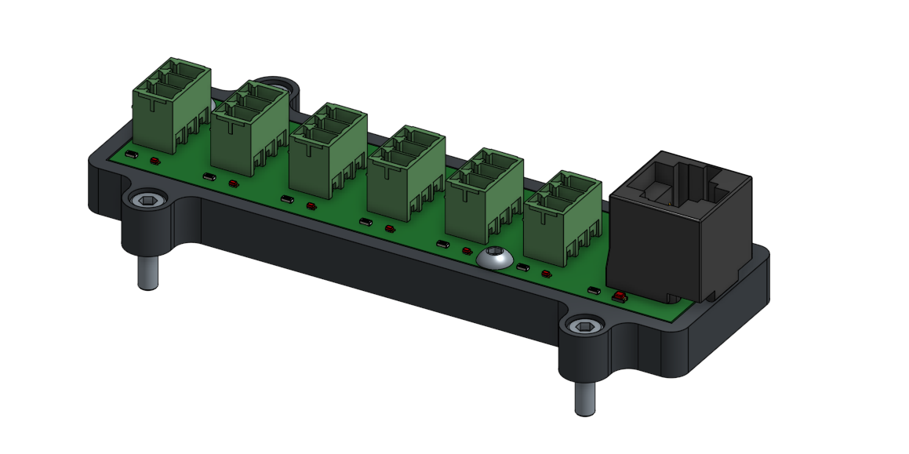
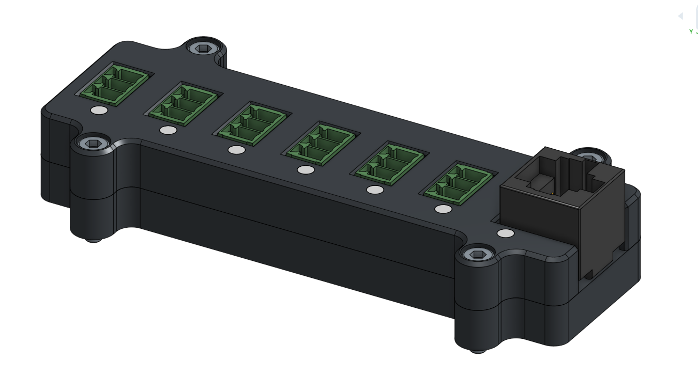

# Limit Breakout Case

This enclosure can be used two ways. The bottom half can be used as a mounting plate on its own:

Or the whole enclosure can be assembled, with the cover and lightpipes: 

 

All hardware is M3. If using the cover, light baffles in the lid are sufficient to retain the PCB without PCB screws, however, the two on the side opposite the LEDS can be installed if desired. 

